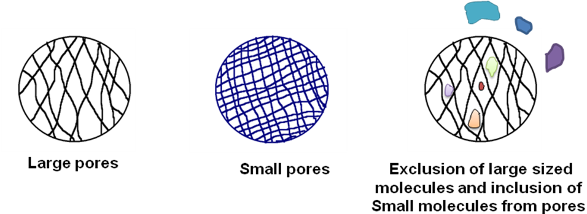
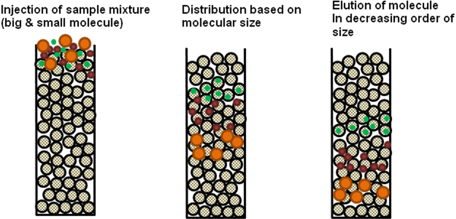
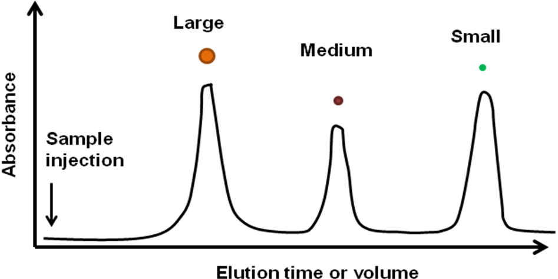

### Theory

This chromatography distributes the protein or analyte, based on their size by passing through a porous beads. The first report in 1955 described performing a chromatography column with swollen gel of maize starch to separate the protein based on their size. '**Porath and Floidin**' coined the term "gel filtration" for this chromatography technique separating the analytes based on molecular sizes. Since then the chromatography technique evolved in terms of developed of different sizes beads to separate protein of narrow range, as well as performing the technique in aqueous and non-aqueous mobile phase. The beads used in gel filtration chromatography is made up of cross linked material (such as dextran in sephadex) to form a 3-D mesh. These 3-D mesh swell in the mobile phase to develop pores of different sizes (Figure 1). The extent of cross linking controls the pores size within the gel beads.

<b>Figure 1: Gel Filtration Matrix has Beads with different pore sizes.</b>

The principle of the chromatography technique is illustrated in Figure 2. The column is packed with the beads containing pores to allow entry of molecules based on their sizes. Smallest size in the inner part of pore followed by gradual increasing size and largest molecule excluded from entering into the gel. The separation between molecules occur due to the time they travel to come out from the pores. When the mobile phase pass through the column, it takes protein along with it. The small molecules present in the inner part of the gel takes longer flow of liquid (or time) and travel longer path to come out where as larger molecules travel less distance to come out. As a result, the large molecule and small molecule get separated from each other. A schematic gel filtration chromatogram is given in Figure 3.

<b>Figure 2: Principle of Gel Filtration Chromatography.</b>

Suppose the total column volume of a gel is Vt and then it is given by -

<b>Vt=Vg+Vi+Vo…………………Eq (1)</b>

Vg is the volume of gel matrix, Vi is the pore volume and Vo is the void volume. The volume of mobile phase flow to elute a column from a column is known as elution volume (Ve). The elution volume is related to the void volume and the distribution coefficient Kd as given below

<b>Ve=Vo+KdVi…………………….Eq (2)</b>

<b>Kd=(Ve-Vo)/Vi…………………….Eq (3)</b>

Kd is the ratio of inner volume available for an analyte and it is independent to the column geometry or length. As per relationship given in Eq (3), three different type of analytes are possible:

1. Analyte with **Kd=0**, or Ve=Vo, these analytes will be completely excluded from the column.
2. Analyte with **Kd=1** or Ve=Vo+Vi, these analytes will be completely in the pore of the column.
3. Analyte with **Kd>1**, in this situation analyte will adsorb to the column matrix.

<b>Figure 3: A typical Gel Filtration Chromatogram.</b>

**Choice of matrix for gel filtration chromatography:** The choice of the column depends on the range of molecular weight and the pressure limit of the operating equipment. A list of popular gel filtration column matrix with the fractionation range are given in Table 1.

### Table 1: List of popular gel filtration matrix

| S.No | Name of the Matrix | Fractionation Range (Daltons) |
| ---- | ------------------ | ----------------------------: |
| 1    | Sephadex G10       |                      Up to 700 |
| 2    | Sephadex G25       |                    1,000-5,000 |
| 3    | Sephadex G50       |                   1,500-30,000 |
| 4    | Sephadex G100      |                  4,000-150,000 |
| 5    | Sephadex G200      |                  5,000-600,000 |
| 6    | Sepharose 4B       |              60,000-20,000,000 |
| 7    | Sepharose 6B       |               10,000-4,000,000 |
